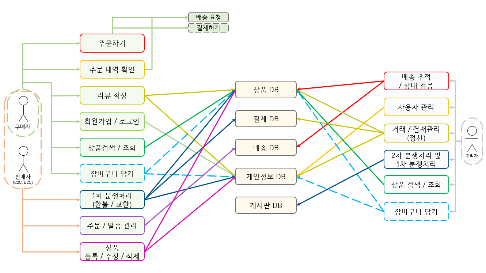
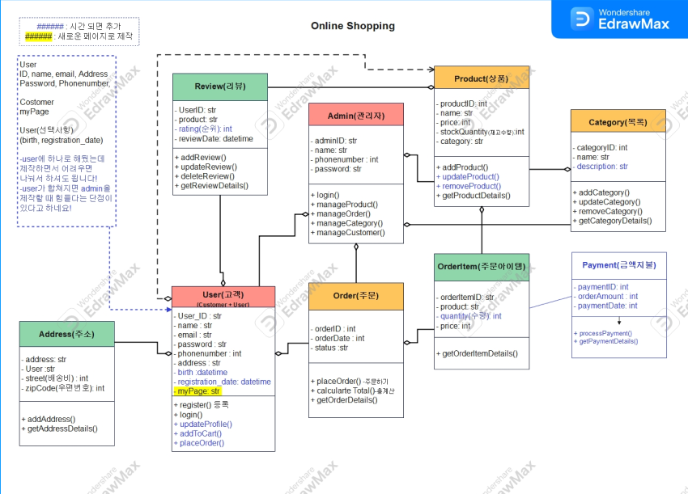
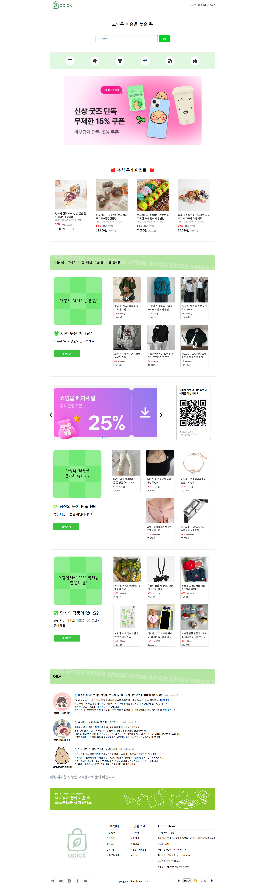
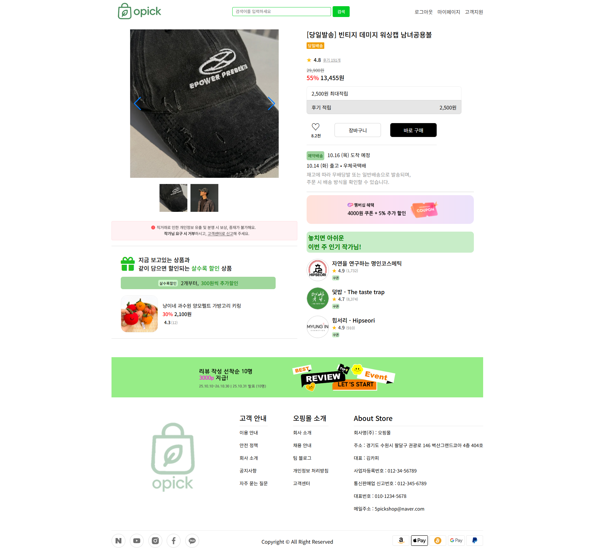
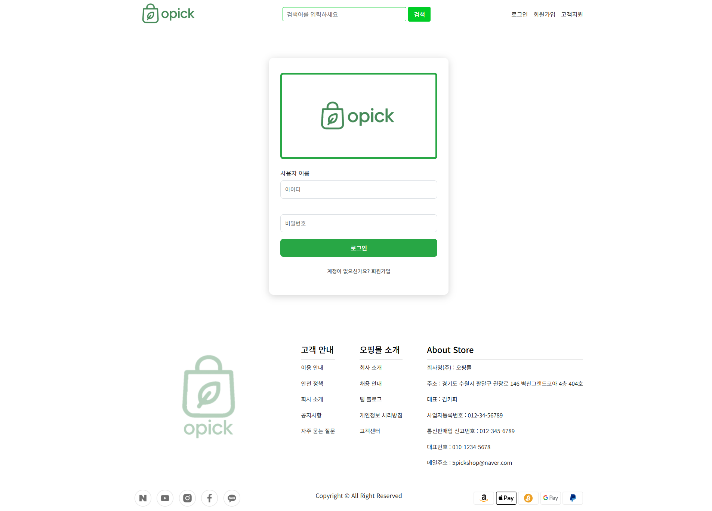
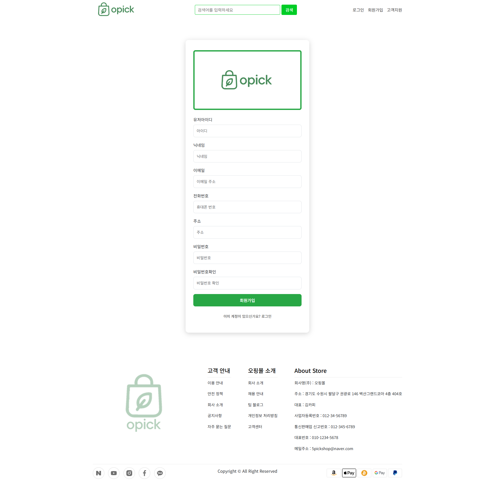
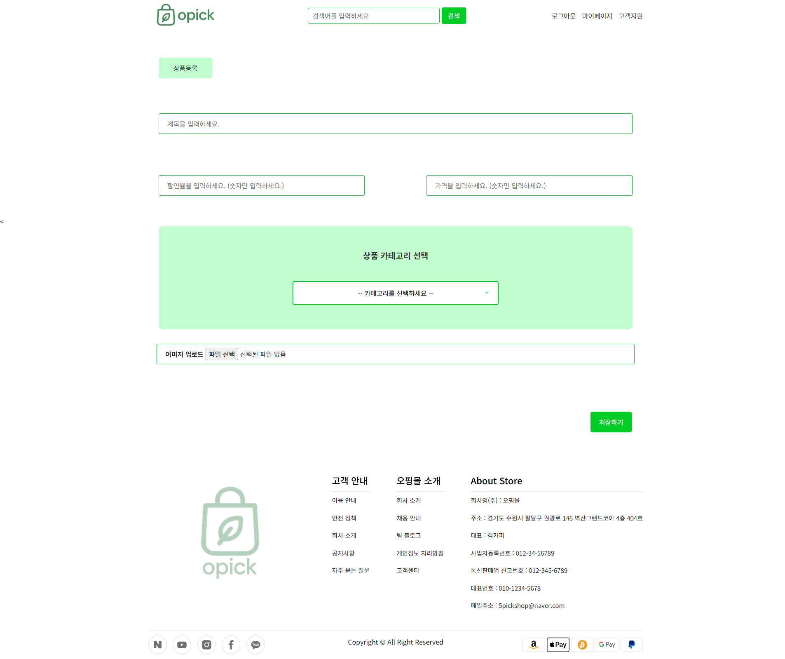
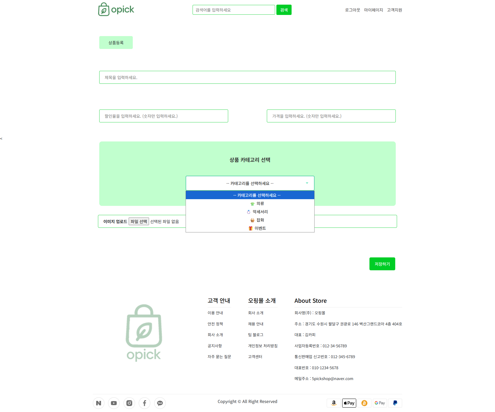
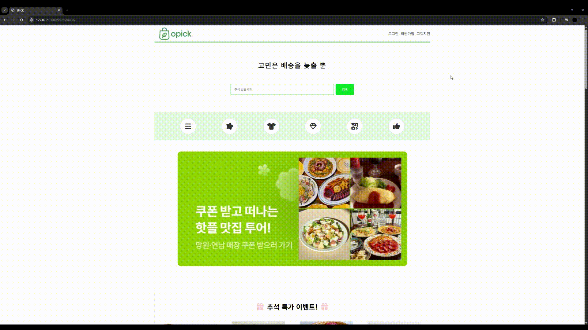
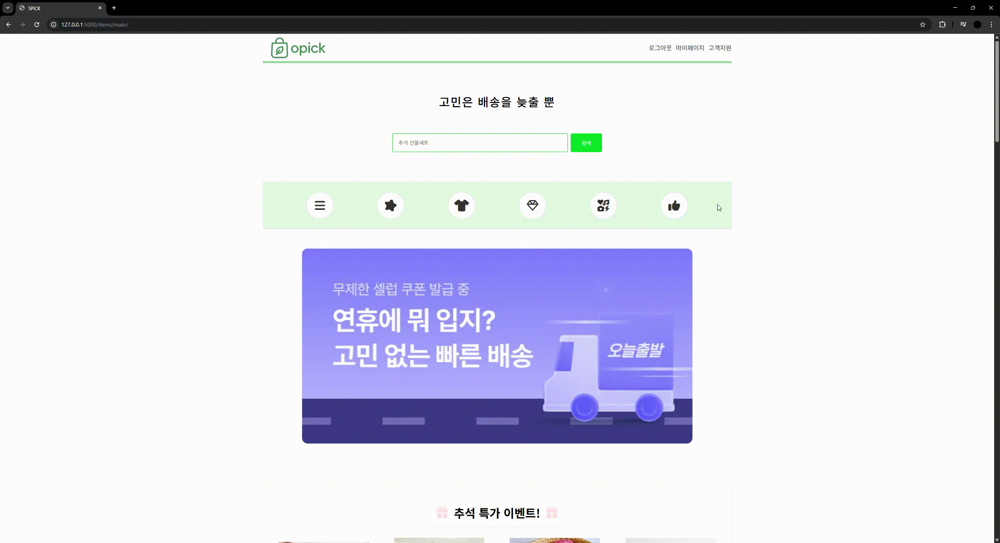

.png)

## 💫 Flask Team Project
플라스크를 이용한 쇼핑몰 사이트 만들기

## 🕒 개발 시간
2025/09/22 ~ 2025/10/14 (약 2주간)

## 🤝 같이 개발한 팀원들
🐯 성득명 : DB, 백엔드, 프론트엔드  
🐴 김태연 : 프론트엔드  
🐰 지수정 : 프론트엔드  
🐲 방승현 : 기본구상

 

## 📜 프로젝트 소개
→ Python 기반 Flask 플레임워크를 사용하여 쇼필몰 웹 페이지의 주요 기능을 설계 및 구현함  
→ 사용자는 회원가입과 로그인이 가능하며 상품을 등록할수 있음 

 

## 📢 기획 의도
"이 프로젝트는 웹 서비스의 전반적인 구조를 직접 설계하고자 하는 학습 목표에서 출발했습니다."
  
기존의 상용 플랫폼이나 프레임워크는 빠르게 결과물을 만들 수 있지만, 그 내부 구조와 동작 원리를 깊이 이해하기에는 한계가 있습니다. 
따라서 Flask를 활용하여 웹 애플리케이션의 핵심 기능을 직접 구현하며  
백엔드와 프론트엔드의 연동 구조를 실습하는 것을 목표로 했습니다. 
 
Flask 프레임워크의 유연성을 이해하고,  
실제 서비스로 확장 가능한 백엔드 설계 능력을 기르는 것이 본 프로젝트의 궁극적인 의도입니다.

 

## 📚 개발환경
<b>→ Frontend</b>: HTML, CSS, JavaScript, Bootstrap 
<b>→ Backend</b>: Flask, SQLite  
<b>→ Tools</b>: Git, GitHub

 

## 📚목차📚

01. [📐 Diagram](#-diagram)
02. [🖥 화면구현](#-화면구현)
03. [🔎 주요기능](#-주요기능)
04. [📂 프로젝트 보고서](#-프로젝트-보고서)
05. [✌ 추후 추가하고싶은 기능](#-추후-추가하고싶은-기능)
06. [📚 배운점](#-배운점)
07. [🧩 문제 해결 사례](#-문제-해결-사례)
08. [🚀 느낀 점](#-느낀-점)
09. [⚙️ 참고](#️-참고)

 

## 📐 Diagram

UseCase

 

클래스 다이어그램

 

 

## 🖥 화면구현

메인페이지

 

서브페이지

 

상품 상세 페이지

 

로그인 페이지

 

회원가입 페이지

 

마이페이지

 

상품 등록 페이지

 

상품 등록 상세

 

 

## 🔎 주요기능
#### 1. 사용자 인증
- 로그인, 회원가입: 사용자 계정 생성 및 로그인 기능.
- 마이페이지: 로그인한 사용자는 본인의 마이페이지에 접근 가능
- 프로필 사진 변경: 마이페이지에서 사용자 프로필 이미지를 업로드 및 변경 가능

#### 2. 데이터베이스 연동
- 사용자 정보 및 상품 정보 저장: Flask와 SQLite를 활용하여 회원,상품 데이터를 관리
- 작성한 판매글 조회: 마이페이지에서 사용자가 지금까지 등록한 판매글을 목록 형태로 확인 가능
- 상품 목록 및 상세 조회: 등록된 판매글을 상품 목록 페이지 및 상세 페이지에서 확인 가능

#### 3. 웹 페이지 및 템플릿 렌더링
- HTML/CSS/JavaScript: 프론트엔드 구현. 
- Flask: 백엔드 구현. 

 

## 🎬 주요기능 실행화면

메인페이지

 

* 화면 구현
* 슬라이더 / 클릭했을 때 이동하는 위치

로그인 / 회원가입

 

서브페이지

 

상품 등록

 

* 마이페이지 → 상품 등록

상품 조회

 

상품 삭제

 

* 마이페이지 → admin이 등록된 상품 삭제

## 📂 프로젝트 보고서
[Opickmall project 결과보고.pdf](./img/project_oshop_문서작성.pdf)

 

## ✌ 추후 추가하고싶은 기능
- 장바구니
- 별점/리뷰페이지
- 댓글/게시판
- 결제 페이지 (API연결)
- 주문/주문내역 확인/찜하기
- 상품 검색

 

## 📚 배운점
- 🐯: 이번 프로젝트를 진행하면서, 평소 자주 사용하던 웹 페이지들이 사용자의 요청이 프론트엔드에서 백엔드, 그리고 데이터베이스로 전달되고 다시 응답이 돌아오는 전체 흐름을 보다 정확하게 이해할 수 있었습니다. 또한 개발 과정에서 데이터베이스 구조를 추가·변경하는 작업을 경험하며, 초기 설계 단계에서 DB를 신중하고 세밀하게 구성하는 것이 프로젝트의 효율성과 안정성에 매우 중요하다는 점을 깨달을 수 있었습니다.

- 🐴: 반복작업으로 적은 시간에 최대한의 디테일을 잡을 수 있는 방법을 배울 수 있었기에 다음 프로젝트를 진행하기 전 조금 더 성장함을 느꼈습니다.
- 🐰: flask 안에서 파일 경로와 사용하는 태그들이 어려웠지만 잘 활용하면 많은 정보와 자료들을 넣을 수 있고 실행 시킬 수 있다는 점이 신기했습니다.
- 🐲: 모든 구성요소를 표현함에 있어서 초기 계획(Diagram 및 Wireframe)이 굉장히 중요하며 결과물도 중요하지만 아래에서부터 쌓아가는 과정을 배울수있었습니다.

 

## 🚀 느낀 점
- 🐯: 이번 프로젝트는 개인이 아닌 팀으로 진행한 만큼, **개개인의 역량뿐만 아니라 팀원들의 참여도와 협업 의지가 프로젝트의 완성도에 큰 영향을 미친다는 점**을 깨달을 수 있었습니다. 또한 중간에 긴 연휴가 겹치면서 일부 기능을 구현하지 못한 점은 아쉬움으로 남았습니다.

- 🐰: 팀 프로젝트에서 맡은 역할을 수행하면서도, 만든 코드가 연동이 잘 되지않아 퀄리티 높고 좋은 결과물을 위해서는 **프로젝트의 이해도와 협업의 중요성**을 느꼈습니다.
- 🐴: 개인적으로는 **백보다 프론트에 집중했었어서** 백에 그다지 큰 비중은 없지만 프론트를 두고 봤을 때에 조금 더 디테일을 잡을 수 있었을텐데 하며 아쉬움이 많이 남는 프로젝트였습니다.
- 🐲: 프론트,백,DB를 모두다 할수는없지만 협업에있어서도 구성요소의 개념을 어느정도는 알고있어야  협업간 팀원들과의 대화가 원할함을 알수있었습니다.

 

## ⚙️ 참고
- 참고 문서: [기획 참고](https://blog.naver.com/red0808/224017584764)